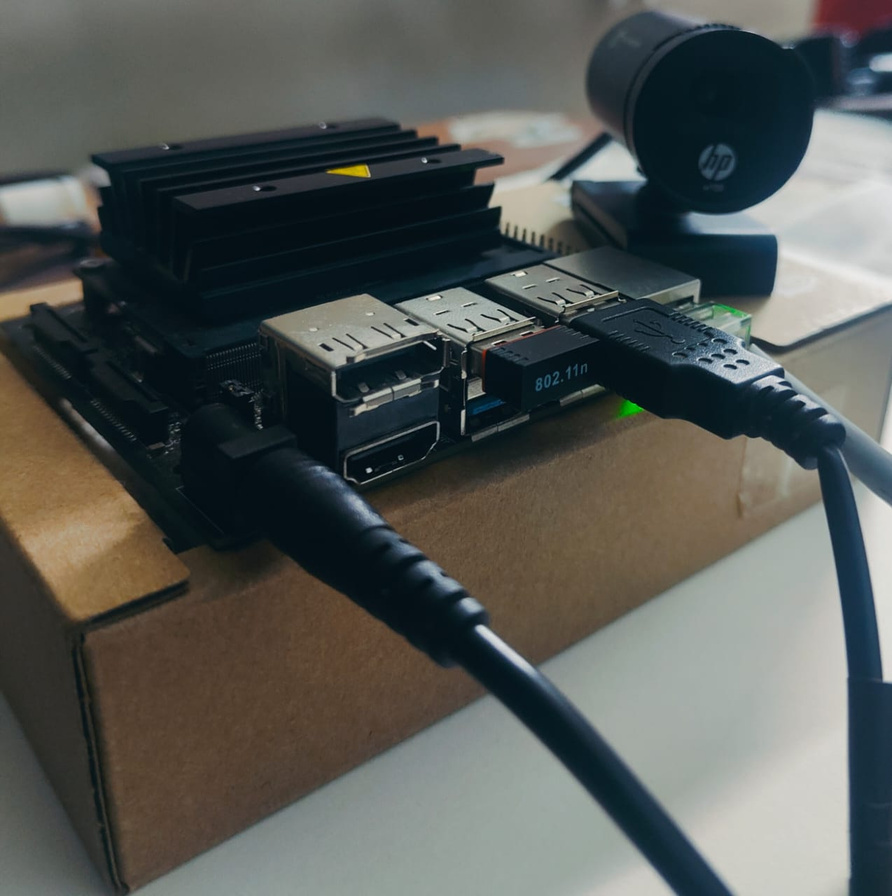
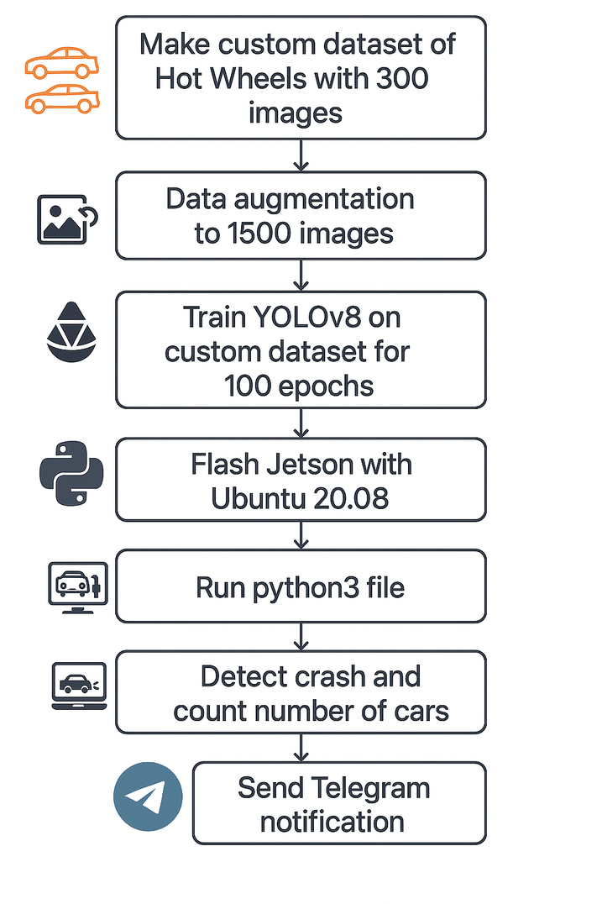
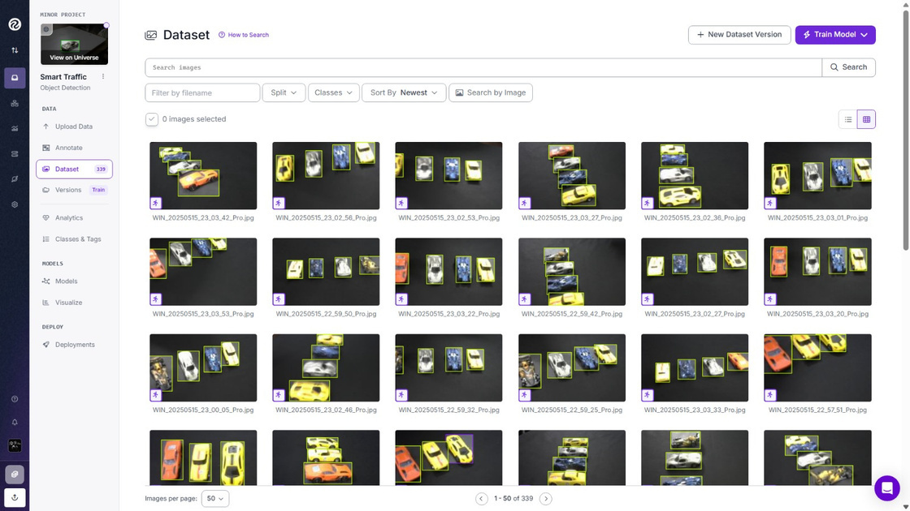
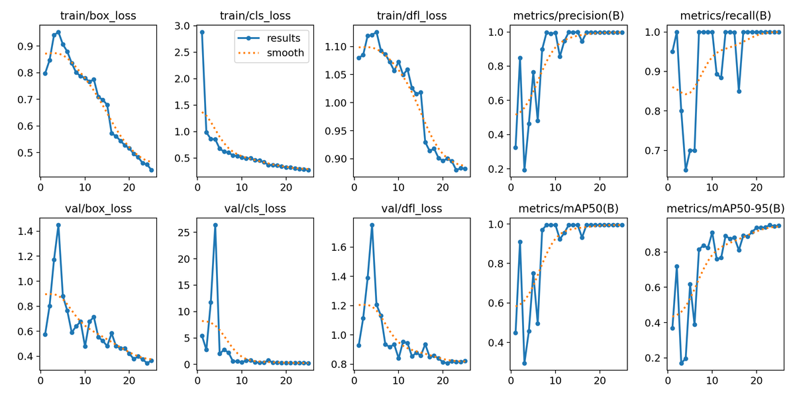
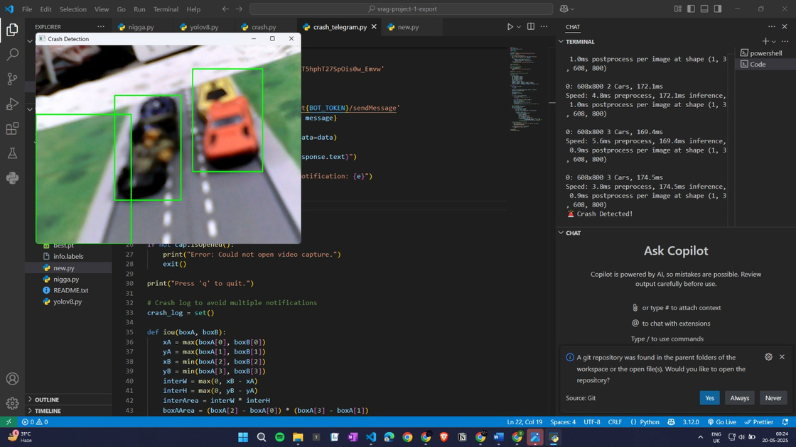
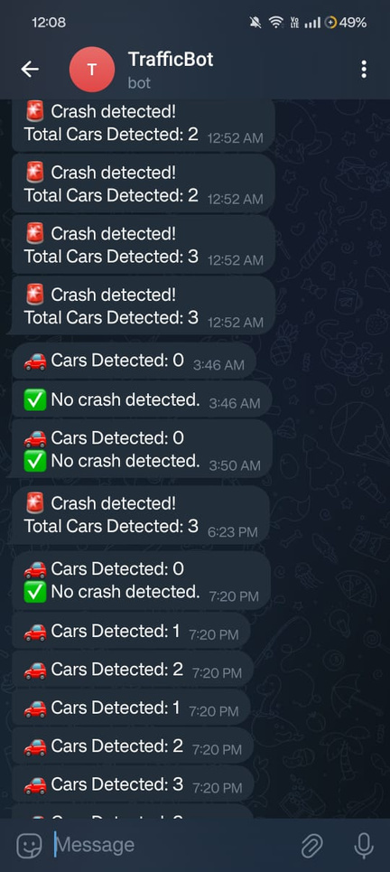

# Smart Traffic Monitoring System 🚦🏎️

[](https://www.nvidia.com/en-us/autonomous-machines/embedded-systems/jetson-nano/)
[](https://github.com/ultralytics/ultralytics)
[](https://www.python.org/)
[](https://opencv.org/)
[](https://core.telegram.org/bots/api)

A real-time edge AI traffic monitoring and collision detection prototype powered by **YOLOv8** on an **NVIDIA Jetson Nano**. Designed for smart city intersections, the system monitors multi-lane vehicle flow, detects potential collisions, and automatically dispatches instant alert notifications via Telegram.

---

## 📌 Features

- **Real-Time Vehicle Detection**: Identifies and classifies vehicles at high frame rates using a fine-tuned YOLOv8 model.
- **Automated Collision Detection**: Real-time bounding box proximity and overlap evaluation to instantly spot accidents.
- **Instant Telegram Alerts**: Automated incident reporting with vehicle counts delivered directly to Telegram in under 3 seconds.
- **Edge AI Optimized**: Lightweight architecture designed for on-device inference on the NVIDIA Jetson Nano.

---

## 🛠️ Hardware & Prototype Setup

The system monitors a physical scaled-down junction with multi-lane markings and miniature vehicles:

<p align="center">
  
  <br />
  <em>NVIDIA Jetson Nano 4GB with overhead USB camera setup</em>
</p>

| Component | Description |
| :--- | :--- |
| **Compute Board** | NVIDIA Jetson Nano (4GB RAM, 128-core Maxwell GPU) |
| **Camera** | Overhead HD USB Camera |
| **Testbed** | Scaled intersection base with roadway lane markings |
| **Fleet** | 6 miniature vehicle models (Gallardo, Porsche 911, Bat Mobile, Ravenger, Honda S800, F1) |

---

## 🔄 System Flow

<p align="center">
  
</p>

1. **Video Ingestion**: Live stream capture from the overhead camera.
2. **YOLOv8 Inference**: Real-time object detection and vehicle classification.
3. **Tracking & Crash Detection**: Continuous monitoring of vehicle count and collision overlap.
4. **Alert Dispatch**: Real-time notification transmission to the Telegram channel.

---

## 📊 Dataset & Model Performance

The model was trained on a custom labeled dataset annotated via Roboflow and trained for 100 epochs using Google Colab GPU acceleration.

<p align="center">
  
  
</p>

| Metric | Result |
| :--- | :--- |
| **mAP@0.5** | **~85%** |
| **Precision** | **~88%** |
| **Recall** | **~86%** |
| **Edge Frame Rate** | **4–6 FPS** (Jetson Nano) |
| **Alert Latency** | **2–3 seconds** (Telegram) |

---

## 📺 Live Output

<p align="center">
  
  
  <br />
  <em>Live detection view with collision bounding box (left) and automated Telegram alert stream (right)</em>
</p>

---

## 📂 Project Structure

```plaintext
Smart-Traffic-Monitoring-System/
├── src/                       # Application source pipelines
│   ├── traffic_monitor.py     # Main real-time monitor with debounced Telegram alerts
│   ├── crash_telegram.py      # Core collision detection pipeline
│   ├── yolov8_cam_test.py     # Camera and inference test script
│   └── dataset_converter.py   # Dataset formatting utility
├── models/                    # Trained YOLOv8 weight checkpoints (.pt)
├── data/                      # Training and testing datasets
├── docs/                      # Presentation PDF and architecture images
├── .env.example               # Configuration template for Telegram credentials
├── requirements.txt           # Python project dependencies
└── README.md                  # Project overview and documentation
```

---

## 🚀 Quickstart

### 1. Clone the Repository
```bash
git clone https://github.com/Moulyyy/Smart-Traffic-Monitoring-System.git
cd Smart-Traffic-Monitoring-System
```

### 2. Install Dependencies
```bash
pip install -r requirements.txt
```

### 3. Configure Telegram Alerts (Optional)
Copy `.env.example` to `.env` and enter your bot details:
```bash
cp .env.example .env
```
```env
TELEGRAM_BOT_TOKEN="your_bot_token"
TELEGRAM_CHAT_ID="your_chat_id"
```

### 4. Run the Monitor
```bash
# Camera validation test
python src/yolov8_cam_test.py

# Main traffic & crash monitoring pipeline
python src/traffic_monitor.py
```

---

## 📄 References
- [Ultralytics YOLOv8 Documentation](https://docs.ultralytics.com)
- [Telegram Bot API](https://core.telegram.org/bots/api)
- [NVIDIA Jetson Nano Developer Kit](https://developer.nvidia.com/embedded/jetson-nano-developer-kit)
